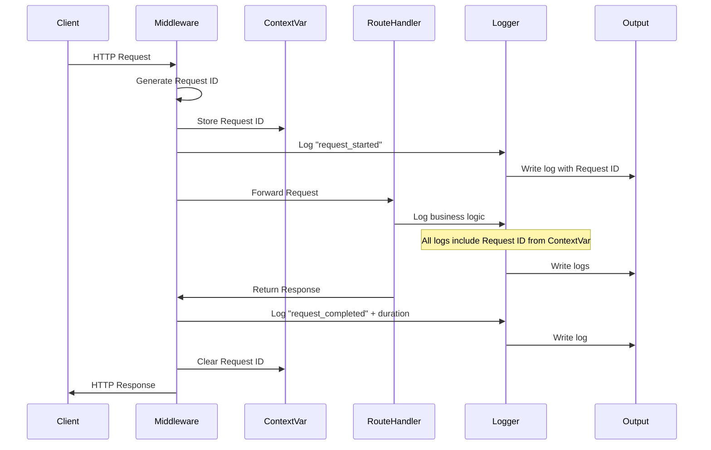

# FastAPI Structured Logging System Documentation

## Table of Contents
1. [Introduction](#introduction)
2. [Why This Solution?](#why-this-solution)
3. [Architecture Overview](#architecture-overview)
4. [Core Components](#core-components)
5. [Request Flow & Lifecycle](#request-flow--lifecycle)
6. [Installation & Setup](#installation--setup)
7. [Usage Patterns](#usage-patterns)
8. [Configuration Reference](#configuration-reference)
9. [Best Practices](#best-practices)
10. [Troubleshooting](#troubleshooting)
11. [Performance Considerations](#performance-considerations)
12. [Security & Compliance](#security--compliance)

---

## Introduction

The FastAPI Structured Logging System is a production-ready, centralized logging solution that provides structured, contextual logging for FastAPI applications. It combines the power of `structlog` with FastAPI's middleware system to deliver comprehensive application observability.

### Key Features
- 📊 **Structured JSON logging** for production environments
- 🎨 **Colored console output** for development
- 🔍 **Automatic request ID tracking** across async operations
- ⚡ **Zero-configuration setup** with sensible defaults
- 📁 **Dual output support** (console + file)
- 🔄 **FastAPI lifespan integration** (modern approach)
- 🛡️ **Error resilience** to prevent logging failures from crashing the app

---

## Why This Solution?

### Problems It Solves

#### 1. **Lack of Request Context in Async Operations**
**Problem**: In async FastAPI applications, tracking a single request across multiple coroutines and services is challenging.

**Solution**: Automatic request ID injection using Python's `contextvars`, ensuring every log entry within a request lifecycle includes the same request ID.

```python
# Without this system:
logger.info("Processing user request")  # Which request? From whom?

# With this system:
logger.info("Processing user request")  
# Output: {..., "request_id": "abc-123", "user_id": 42, ...}
```

#### 2. **Inconsistent Log Formats**
**Problem**: Different developers logging in different formats makes parsing and analysis difficult.

**Solution**: Enforced structured logging with consistent field names and formats.

```python
# Inconsistent (bad):
print(f"User {user_id} logged in at {time}")
logger.info("Login: " + str(user_id))

# Structured (good):
logger.info("user_login", user_id=user_id, timestamp=time)
# Output: {"event": "user_login", "user_id": 123, "timestamp": "2024-01-01T10:00:00Z"}
```

#### 3. **Development vs Production Logging**
**Problem**: Developers need readable logs locally, but production needs machine-parseable JSON.

**Solution**: Environment-aware formatting with a single configuration flag.

```python
# Development: Beautiful, colored, human-readable
2024-01-01 10:00:00 [INFO] user_login user_id=123 email=user@example.com

# Production: JSON for log aggregation systems
{"timestamp":"2024-01-01T10:00:00Z","level":"info","event":"user_login","user_id":123}
```

#### 4. **Missing Request/Response Metadata**
**Problem**: Critical information like response times, status codes, and client IPs often go unlogged.

**Solution**: Automatic middleware that logs every request/response with timing and metadata.

---

## Architecture Overview

### System Components Diagram

```
┌─────────────────────────────────────────────────────────────┐
│                     FastAPI Application                      │
├─────────────────────────────────────────────────────────────┤
│                                                              │
│  ┌────────────────────────────────────────────────────┐     │
│  │              Lifespan Context Manager              │     │
│  │  • Application startup/shutdown logging            │     │
│  │  • Resource initialization tracking                │     │
│  └────────────────────────────────────────────────────┘     │
│                                                              │
│  ┌────────────────────────────────────────────────────┐     │
│  │              Logging Middleware Layer              │     │
│  │  • Request ID generation/extraction                │     │
│  │  • Request/Response logging                        │     │
│  │  • Duration calculation                            │     │
│  │  • Error capture and logging                       │     │
│  └────────────────────────────────────────────────────┘     │
│                                                              │
│  ┌────────────────────────────────────────────────────┐     │
│  │                 Structlog Core                     │     │
│  │  ┌──────────────┐  ┌──────────────┐              │     │
│  │  │  Processors  │  │   Context    │              │     │
│  │  │  • Add timestamp                │              │     │
│  │  │  • Add request ID               │              │     │
│  │  │  • Add app context              │              │     │
│  │  │  • Format exceptions            │              │     │
│  │  └──────────────┘  └──────────────┘              │     │
│  └────────────────────────────────────────────────────┘     │
│                                                              │
│  ┌────────────────────────────────────────────────────┐     │
│  │                Output Handlers                     │     │
│  │  ┌──────────────┐  ┌──────────────┐              │     │
│  │  │Console Handler│  │File Handler  │              │     │
│  │  │ • Colored    │  │ • JSON only  │              │     │
│  │  │ • Human-readable│ • Persistent  │              │     │
│  │  └──────────────┘  └──────────────┘              │     │
│  └────────────────────────────────────────────────────┘     │
│                                                              │
└─────────────────────────────────────────────────────────────┘
```

### Data Flow Architecture

```
Request Lifecycle:
================

1. HTTP Request Arrives
        ↓
2. LoggingMiddleware intercepts
        ↓
3. Generate/Extract Request ID
        ↓
4. Set Request ID in ContextVar
        ↓
5. Log "request_started"
        ↓
6. Forward to Route Handler
        ↓
7. Route Handler processes
   (all logs include Request ID)
        ↓
8. Generate Response
        ↓
9. Log "request_completed"
        ↓
10. Clear Request ID from context
        ↓
11. Return Response to Client
```

---

## Core Components

### 1. **Context Variables (Request Tracking)**

```python
request_id_var: ContextVar[Optional[str]] = ContextVar("request_id", default=None)
```

**Purpose**: Thread-safe storage for request-scoped data in async contexts.

**How it works**:
- Each request gets a unique ID stored in a `ContextVar`
- All async operations within that request automatically have access to this ID
- Cleared after request completion to prevent memory leaks

### 2. **Processor Chain**

Processors transform log events before output. They run in sequence:

```python
processors = [
    structlog.contextvars.merge_contextvars,  # 1. Merge context variables
    add_request_id,                           # 2. Add request ID if present
    add_app_context,                          # 3. Add app name and environment
    structlog.stdlib.add_log_level,           # 4. Add log level
    structlog.stdlib.add_logger_name,         # 5. Add logger name
    structlog.processors.TimeStamper(fmt="iso", utc=True),  # 6. Add timestamp
    structlog.processors.StackInfoRenderer(), # 7. Add stack info
    structlog.processors.format_exc_info,     # 8. Format exceptions
    structlog.processors.UnicodeDecoder(),    # 9. Decode unicode
    # Final renderer (JSON or Console)
]
```

### 3. **Middleware Layer**

```python
class LoggingMiddleware(BaseHTTPMiddleware):
    async def dispatch(self, request: Request, call_next):
        # Pre-processing
        request_id = generate_or_extract_request_id()
        set_context(request_id)
        log_request_start()
        
        # Process request
        response = await call_next(request)
        
        # Post-processing
        log_request_complete(duration)
        clear_context()
        
        return response
```

### 4. **Lifespan Management**

Modern FastAPI lifespan approach for application lifecycle logging:

```python
@asynccontextmanager
async def lifespan(app: FastAPI):
    # Startup
    logger.info("application_starting")
    await initialize_resources()
    logger.info("application_ready")
    
    yield  # Application runs
    
    # Shutdown
    logger.info("application_stopping")
    await cleanup_resources()
    logger.info("application_stopped")
```

---

## Request Flow & Lifecycle

### Detailed Request Processing Flow



### Application Lifecycle Flow

```
Application Start:
==================
1. Python interpreter starts
2. setup_logging() called
3. Configure structlog processors
4. Setup output handlers (console/file)
5. Lifespan context entered
6. Log "application_started"
7. Run custom startup tasks
8. Application ready to serve

Request Processing:
==================
1. Request arrives at server
2. LoggingMiddleware activated
3. Request ID generated/extracted
4. Context established
5. Request logged
6. Route handler executed
7. Business logic runs (with logging)
8. Response generated
9. Response logged with timing
10. Context cleared
11. Response sent to client

Application Shutdown:
====================
1. Shutdown signal received
2. Lifespan context exiting
3. Log "application_stopping"
4. Run custom shutdown tasks
5. Close resources
6. Log "application_shutdown"
7. Process terminates
```

---

## Installation & Setup

### Requirements

```bash
pip install fastapi structlog uvicorn
```

### Quick Start

#### Option 1: Automatic Setup (Recommended for most cases)

```python
from fastapi import FastAPI
from logging_utility import setup_app_logging, get_logger

# Create app
app = FastAPI(title="My API", version="1.0.0")

# Setup logging with defaults
setup_app_logging(
    app,
    log_level="INFO",
    use_json=False,  # Colored output for development
    environment="development"
)

# Use in your routes
@app.get("/")
async def root():
    logger = get_logger(__name__)
    logger.info("Processing request", endpoint="root")
    return {"status": "ok"}
```

#### Option 2: Custom Lifespan with Logging

```python
from contextlib import asynccontextmanager
from fastapi import FastAPI
from logging_utility import setup_app_logging, get_logger

@asynccontextmanager
async def lifespan(app: FastAPI):
    logger = get_logger("app.lifecycle")
    
    # Startup
    logger.info("Initializing database connection")
    # await init_database()
    logger.info("Loading ML models")
    # await load_models()
    logger.info("Application ready")
    
    yield
    
    # Shutdown
    logger.info("Closing database connections")
    # await close_database()
    logger.info("Cleanup completed")

app = FastAPI(title="My API", lifespan=lifespan)

# Setup logging without automatic lifespan
setup_app_logging(
    app,
    log_level="INFO",
    use_json=True,
    environment="production",
    setup_lifespan=False  # Important: we have custom lifespan
)
```

#### Option 3: All-in-One App Creation

```python
from logging_utility import create_app_with_logging

async def startup_tasks():
    # Your initialization code
    pass

async def shutdown_tasks():
    # Your cleanup code
    pass

app = create_app_with_logging(
    title="My API",
    version="2.0.0",
    log_level="INFO",
    use_json=True,
    log_file="/var/log/myapp.log",
    environment="production",
    custom_startup=startup_tasks,
    custom_shutdown=shutdown_tasks
)
```

---

## Usage Patterns

### Basic Logging in Routes

```python
from logging_utility import get_logger

@app.post("/users")
async def create_user(user: UserCreate):
    logger = get_logger(__name__)
    
    # Simple log
    logger.info("Creating new user", email=user.email)
    
    try:
        # Business logic
        user_id = await db.create_user(user)
        logger.info("User created successfully", user_id=user_id, email=user.email)
        return {"user_id": user_id}
    
    except DuplicateEmailError as e:
        logger.warning("Duplicate email attempted", email=user.email)
        raise HTTPException(status_code=400, detail="Email already exists")
    
    except Exception as e:
        logger.error("Failed to create user", email=user.email, error=str(e), exc_info=True)
        raise HTTPException(status_code=500, detail="Internal server error")
```

### Background Tasks with Logging Context

```python
from fastapi import BackgroundTasks

@app.post("/send-email")
async def send_email(email: EmailSchema, background_tasks: BackgroundTasks):
    logger = get_logger(__name__)
    
    # Capture request ID for background task
    request_id = request_id_var.get()
    
    async def send_email_task():
        # Restore request context in background task
        request_id_var.set(request_id)
        
        logger.info("Sending email", recipient=email.to, subject=email.subject)
        
        try:
            await email_service.send(email)
            logger.info("Email sent successfully", recipient=email.to)
        except Exception as e:
            logger.error("Failed to send email", recipient=email.to, error=str(e))
        finally:
            request_id_var.set(None)
    
    background_tasks.add_task(send_email_task)
    logger.info("Email queued for sending", recipient=email.to)
    
    return {"status": "queued"}
```

### Service Layer Logging

```python
class UserService:
    def __init__(self):
        self.logger = get_logger(self.__class__.__name__)
    
    async def get_user(self, user_id: int) -> User:
        self.logger.info("Fetching user", user_id=user_id)
        
        # Check cache
        cached = await cache.get(f"user:{user_id}")
        if cached:
            self.logger.info("User found in cache", user_id=user_id)
            return cached
        
        # Query database
        self.logger.info("Querying database for user", user_id=user_id)
        user = await db.get_user(user_id)
        
        if not user:
            self.logger.warning("User not found", user_id=user_id)
            raise UserNotFoundError(user_id)
        
        # Update cache
        await cache.set(f"user:{user_id}", user, ttl=300)
        self.logger.info("User cached", user_id=user_id, ttl=300)
        
        return user
```

### Database Operations Logging

```python
class DatabaseLogger:
    def __init__(self):
        self.logger = get_logger("db")
    
    async def execute_query(self, query: str, params: dict = None):
        query_id = str(uuid.uuid4())[:8]
        
        self.logger.info(
            "Executing query",
            query_id=query_id,
            query=query[:100],  # Log first 100 chars
            has_params=bool(params)
        )
        
        start_time = time.time()
        try:
            result = await db.execute(query, params)
            duration = (time.time() - start_time) * 1000
            
            self.logger.info(
                "Query completed",
                query_id=query_id,
                duration_ms=duration,
                rows_affected=result.rowcount
            )
            
            return result
            
        except Exception as e:
            duration = (time.time() - start_time) * 1000
            
            self.logger.error(
                "Query failed",
                query_id=query_id,
                duration_ms=duration,
                error=str(e),
                exc_info=True
            )
            raise
```

---

## Configuration Reference

### setup_logging() Parameters

| Parameter | Type | Default | Description |
|-----------|------|---------|-------------|
| `log_level` | str | "INFO" | Logging level: DEBUG, INFO, WARNING, ERROR, CRITICAL |
| `use_json` | bool | True | Use JSON format (True) or colored console (False) |
| `log_file` | Optional[str] | None | Path to log file for persistent storage |
| `app_name` | str | "fastapi-app" | Application name included in all logs |
| `environment` | str | "development" | Environment: development, staging, production |

### setup_app_logging() Parameters

All parameters from `setup_logging()` plus:

| Parameter | Type | Default | Description |
|-----------|------|---------|-------------|
| `app` | FastAPI | Required | FastAPI application instance |
| `setup_lifespan` | bool | True | Whether to setup automatic lifespan logging |

### Environment-Specific Configurations

#### Development Configuration

```python
setup_app_logging(
    app,
    log_level="DEBUG",        # More verbose logging
    use_json=False,           # Human-readable colored output
    log_file="dev.log",       # Optional local file
    environment="development"
)
```

**Output Example**:
```
2024-01-01T10:00:00.123Z [debug    ] Database query executed [db] query="SELECT * FROM users" duration_ms=45.2
2024-01-01T10:00:00.124Z [info     ] User fetched           [api.users] user_id=123 email=user@example.com
```

#### Production Configuration

```python
setup_app_logging(
    app,
    log_level="INFO",              # Standard verbosity
    use_json=True,                 # Machine-readable JSON
    log_file="/var/log/app.log",   # Persistent storage
    environment="production"
)
```

**Output Example**:
```json
{"timestamp":"2024-01-01T10:00:00.123Z","level":"info","event":"user_fetched","logger":"api.users","app":"my-api","environment":"production","request_id":"abc-123","user_id":123}
```

#### Staging Configuration

```python
setup_app_logging(
    app,
    log_level="INFO",
    use_json=True,                 # JSON like production
    log_file="/var/log/staging.log",
    environment="staging"
)
```

---

## Best Practices

### 1. **Consistent Event Naming**

Use snake_case event names that describe what happened:

```python
# Good
logger.info("user_created", user_id=123)
logger.info("payment_processed", amount=99.99)
logger.info("cache_miss", key="user:123")

# Bad
logger.info("Created user", user_id=123)
logger.info("PAYMENT_DONE", amount=99.99)
logger.info("Cache didn't hit", key="user:123")
```

### 2. **Structured Context Over String Formatting**

```python
# Bad: String formatting loses structure
logger.info(f"User {user_id} logged in from {ip_address}")

# Good: Structured data preserved
logger.info("user_login", user_id=user_id, ip_address=ip_address)
```

### 3. **Log Levels Guidelines**

| Level | Use Case | Example |
|-------|----------|---------|
| DEBUG | Detailed diagnostic info | SQL queries, function arguments |
| INFO | Normal business operations | User login, order placed |
| WARNING | Unexpected but handled | Rate limit hit, fallback used |
| ERROR | Errors requiring attention | Database connection failed |
| CRITICAL | System-wide failures | Out of memory, disk full |

### 4. **Security Considerations**

```python
# Never log sensitive data
logger.info("user_login", 
    user_id=user.id,      # ✓ Safe
    email=user.email,     # ✓ Safe (usually)
    # password=password,  # ✗ NEVER log passwords
    # ssn=user.ssn,       # ✗ NEVER log PII
    # credit_card=cc,     # ✗ NEVER log payment info
)

# Sanitize when necessary
logger.info("payment_processed",
    user_id=user.id,
    amount=payment.amount,
    card_last_four=payment.card_number[-4:],  # Only last 4 digits
    card_type=payment.card_type
)
```

### 5. **Performance Optimization**

```python
# Avoid expensive operations in log calls
# Bad: Serialization happens even if log level is higher
logger.debug("Large object", data=expensive_to_json_function())

# Good: Lazy evaluation
if logger.isEnabledFor(logging.DEBUG):
    logger.debug("Large object", data=expensive_to_json_function())

# Or use lambda for lazy evaluation
logger.debug("Large object", data=lambda: expensive_to_json_function())
```

### 6. **Error Logging Pattern**

```python
try:
    result = await risky_operation()
except SpecificError as e:
    # Log at warning for expected errors
    logger.warning("Expected error occurred", error=str(e), operation="risky_operation")
    # Handle gracefully
    return fallback_value
except Exception as e:
    # Log at error with full traceback for unexpected errors
    logger.error("Unexpected error in risky operation", 
                error=str(e), 
                exc_info=True)  # Includes full traceback
    # Re-raise or handle
    raise
```

---

## Troubleshooting

### Common Issues and Solutions

#### Issue 1: Logs Not Appearing

**Symptoms**: No log output despite calling logger methods

**Solutions**:
```python
# Check log level
import logging
print(f"Current log level: {logging.root.level}")

# Ensure logger is properly initialized
logger = get_logger(__name__)
logger.info("Test message")  # Should appear

# Check if handlers are present
print(f"Handlers: {logging.root.handlers}")
```

#### Issue 2: Request ID Not Propagating

**Symptoms**: Request ID missing in some logs

**Solutions**:
```python
# Ensure middleware is added
app.add_middleware(LoggingMiddleware)

# For background tasks, manually propagate context
request_id = request_id_var.get()
async def background_task():
    request_id_var.set(request_id)
    # Your code here
    request_id_var.set(None)
```

#### Issue 3: File Logging Not Working

**Symptoms**: Console logs work but file is empty

**Solutions**:
```python
# Check file permissions
import os
log_dir = os.path.dirname(log_file)
if not os.path.exists(log_dir):
    os.makedirs(log_dir)

# Ensure file path is absolute
log_file = os.path.abspath("./logs/app.log")

# Check file handler is added
for handler in logging.root.handlers:
    print(f"Handler: {type(handler).__name__}")
```

#### Issue 4: JSON Logs in Development

**Symptoms**: Getting JSON output when expecting colored console

**Solutions**:
```python
# Explicitly set use_json=False
setup_app_logging(
    app,
    use_json=False,  # Force colored output
    environment="development"
)

# Check terminal support for colors
import sys
print(f"TTY: {sys.stdout.isatty()}")  # Should be True for color support
```

---

## Performance Considerations

### Benchmarks

| Operation | Time (μs) | Impact |
|-----------|-----------|---------|
| Request ID generation | 0.5 | Negligible |
| Context variable set/get | 0.1 | Negligible |
| JSON serialization (small) | 2-5 | Low |
| JSON serialization (large) | 50-200 | Medium |
| File write (buffered) | 10-50 | Low |
| Console output (colored) | 20-100 | Low-Medium |

### Optimization Strategies

#### 1. **Async File Writing**

For high-throughput applications, consider async file writing:

```python
import aiofiles

class AsyncFileHandler:
    async def write_log(self, message):
        async with aiofiles.open(self.log_file, 'a') as f:
            await f.write(message + '\n')
```

#### 2. **Log Sampling**

For very high traffic, sample logs:

```python
import random

class SamplingLogger:
    def __init__(self, sample_rate=0.1):  # Log 10% of requests
        self.sample_rate = sample_rate
        self.logger = get_logger(__name__)
    
    def should_log(self):
        return random.random() < self.sample_rate
    
    def info(self, message, **kwargs):
        if self.should_log():
            self.logger.info(message, sampled=True, **kwargs)
```

#### 3. **Buffered Writing**

Batch log writes for better I/O performance:

```python
from collections import deque
import asyncio

class BufferedLogger:
    def __init__(self, buffer_size=100, flush_interval=1.0):
        self.buffer = deque(maxlen=buffer_size)
        self.flush_interval = flush_interval
        asyncio.create_task(self.flush_periodically())
    
    async def flush_periodically(self):
        while True:
            await asyncio.sleep(self.flush_interval)
            await self.flush()
    
    async def flush(self):
        if self.buffer:
            # Write all buffered logs at once
            logs = list(self.buffer)
            self.buffer.clear()
            await self.write_batch(logs)
```

---

## Security & Compliance

### Data Privacy

#### PII Handling

```python
from typing import Any, Dict
import re

class PIISanitizer:
    """Sanitize personally identifiable information in logs"""
    
    PII_PATTERNS = {
        'email': (r'\b[A-Za-z0-9._%+-]+@[A-Za-z0-9.-]+\.[A-Z|a-z]{2,}\b', '[EMAIL]'),
        'phone': (r'\b\d{3}[-.]?\d{3}[-.]?\d{4}\b', '[PHONE]'),
        'ssn': (r'\b\d{3}-\d{2}-\d{4}\b', '[SSN]'),
        'credit_card': (r'\b\d{4}[\s-]?\d{4}[\s-]?\d{4}[\s-]?\d{4}\b', '[CC]'),
    }
    
    def sanitize(self, data: Dict[str, Any]) -> Dict[str, Any]:
        """Sanitize PII from log data"""
        sanitized = {}
        for key, value in data.items():
            if isinstance(value, str):
                sanitized[key] = self._sanitize_string(value)
            elif isinstance(value, dict):
                sanitized[key] = self.sanitize(value)
            else:
                sanitized[key] = value
        return sanitized
    
    def _sanitize_string(self, text: str) -> str:
        """Replace PII patterns in string"""
        for pattern, replacement in self.PII_PATTERNS.values():
            text = re.sub(pattern, replacement, text)
        return text

# Usage
sanitizer = PIISanitizer()

@app.post("/users")
async def create_user(user: UserCreate):
    logger = get_logger(__name__)
    
    # Sanitize before logging
    safe_data = sanitizer.sanitize(user.dict())
    logger.info("Creating user", **safe_data)
```

### Compliance Requirements

#### GDPR Compliance

```python
class GDPRCompliantLogger:
    """Logger that respects GDPR requirements"""
    
    def __init__(self):
        self.logger = get_logger(__name__)
        self.user_consent = {}  # Track user consent
    
    def log_user_action(self, user_id: str, action: str, **kwargs):
        """Log only if user has given consent"""
        if self.has_consent(user_id):
            self.logger.info(action, user_id=user_id, **kwargs)
        else:
            # Log without PII
            self.logger.info(action, user_id=hash(user_id), **kwargs)
    
    def has_consent(self, user_id: str) -> bool:
        """Check if user has given consent for logging"""
        return self.user_consent.get(user_id, False)
```

#### Audit Logging

```python
class AuditLogger:
    """Specialized logger for audit trails"""
    
    def __init__(self):
        self.logger = get_logger("audit")
    
    def log_access(self, user_id: str, resource: str, action: str, result: str):
        """Log access attempts for audit purposes"""
        self.logger.info(
            "audit_access",
            user_id=user_id,
            resource=resource,
            action=action,
            result=result,
            timestamp=datetime.now(timezone.utc).isoformat(),
            # Include additional compliance fields
            compliance_version="GDPR-2.0",
            retention_days=90
        )
    
    def log_data_change(self, user_id: str, entity: str, entity_id: str, 
                        changes: dict, reason: str):
        """Log data modifications for audit trail"""
        self.logger.info(
            "audit_data_change",
            user_id=user_id,
            entity=entity,
            entity_id=entity_id,
            changes=changes,
            reason=reason,
            timestamp=datetime.now(timezone.utc).isoformat()
        )
```

### Log Retention Policies

```python
import os
from datetime import datetime, timedelta

class LogRotationManager:
    """Manage log rotation and retention"""
    
    def __init__(self, log_dir: str, retention_days: int = 30):
        self.log_dir = log_dir
        self.retention_days = retention_days
    
    async def cleanup_old_logs(self):
        """Remove logs older than retention period"""
        cutoff_date = datetime.now() - timedelta(days=self.retention_days)
        
        for filename in os.listdir(self.log_dir):
            filepath = os.path.join(self.log_dir, filename)
            
            # Check file age
            file_time = datetime.fromtimestamp(os.path.getmtime(filepath))
            
            if file_time < cutoff_date:
                os.remove(filepath)
                logger.info("Removed old log file", 
                          filename=filename, 
                          age_days=(datetime.now() - file_time).days)
```

---

## Integration Examples

### With Prometheus Metrics

```python
from prometheus_client import Counter, Histogram
import time

# Define metrics
request_count = Counter('http_requests_total', 'Total HTTP requests', 
                       ['method', 'endpoint', 'status'])
request_duration = Histogram('http_request_duration_seconds', 
                           'HTTP request duration')

class MetricsMiddleware:
    async def __call__(self, request: Request, call_next):
        # Start timer
        start_time = time.time()
        
        # Process request
        response = await call_next(request)
        
        # Record metrics
        duration = time.time() - start_time
        request_count.labels(
            method=request.method,
            endpoint=request.url.path,
            status=response.status_code
        ).inc()
        request_duration.observe(duration)
        
        # Also log
        logger = get_logger("metrics")
        logger.info("request_metrics",
                   method=request.method,
                   path=request.url.path,
                   status=response.status_code,
                   duration_seconds=duration)
        
        return response
```

### With Sentry Error Tracking

```python
import sentry_sdk
from sentry_sdk.integrations.logging import LoggingIntegration

# Configure Sentry with structlog
sentry_logging = LoggingIntegration(
    level=logging.INFO,        # Capture info and above as breadcrumbs
    event_level=logging.ERROR  # Send errors as events
)

sentry_sdk.init(
    dsn="your-sentry-dsn",
    integrations=[sentry_logging],
    traces_sample_rate=0.1,
)

# Custom processor to add Sentry context
def add_sentry_context(logger, method_name, event_dict):
    """Add Sentry-specific context to logs"""
    if request_id := request_id_var.get():
        sentry_sdk.set_tag("request_id", request_id)
    
    # Add user context if available
    if user_id := event_dict.get("user_id"):
        sentry_sdk.set_user({"id": user_id})
    
    return event_dict
```

### With ELK Stack

```python
# Logstash configuration for parsing structlog JSON
logstash_config = """
input {
  file {
    path => "/var/log/app/*.log"
    codec => json
    type => "application"
  }
}

filter {
  if [type] == "application" {
    date {
      match => [ "timestamp", "ISO8601" ]
      target => "@timestamp"
    }
    
    mutate {
      add_field => {
        "[@metadata][index_name]" => "app-logs-%{+YYYY.MM.dd}"
      }
    }
  }
}

output {
  elasticsearch {
    hosts => ["localhost:9200"]
    index => "%{[@metadata][index_name]}"
  }
}
"""

# Kibana query examples
kibana_queries = {
    "slow_requests": 'event:"request_completed" AND duration_ms:>1000',
    "errors": 'level:"error" OR level:"critical"',
    "specific_user": 'user_id:12345',
    "request_trace": 'request_id:"abc-123-def"'
}
```

---

## Migration Guide

### From Python logging to Structlog

```python
# Before: Standard Python logging
import logging

logging.basicConfig(level=logging.INFO)
logger = logging.getLogger(__name__)

@app.get("/users/{user_id}")
async def get_user(user_id: int):
    logger.info(f"Getting user {user_id}")
    user = await db.get_user(user_id)
    logger.info(f"Found user: {user.email}")
    return user

# After: Structlog
from logging_utility import get_logger

@app.get("/users/{user_id}")
async def get_user(user_id: int):
    logger = get_logger(__name__)
    logger.info("fetching_user", user_id=user_id)
    user = await db.get_user(user_id)
    logger.info("user_fetched", user_id=user_id, email=user.email)
    return user
```

### From Loguru to Structlog

```python
# Before: Loguru
from loguru import logger

@app.get("/users/{user_id}")
async def get_user(user_id: int):
    logger.info(f"Getting user {user_id}")
    user = await db.get_user(user_id)
    logger.success(f"Found user: {user.email}")
    return user

# After: Structlog
from logging_utility import get_logger

@app.get("/users/{user_id}")
async def get_user(user_id: int):
    logger = get_logger(__name__)
    logger.info("fetching_user", user_id=user_id)
    user = await db.get_user(user_id)
    logger.info("user_fetched", user_id=user_id, email=user.email, success=True)
    return user
```

---

## Conclusion

This structured logging system provides a robust, production-ready solution for FastAPI applications that addresses common logging challenges:

✅ **Consistent Structure**: All logs follow the same format  
✅ **Request Tracing**: Automatic request ID propagation  
✅ **Performance**: Minimal overhead with optimization options  
✅ **Flexibility**: Adapts to development and production needs  
✅ **Security**: Built-in PII handling and compliance features  
✅ **Integration**: Works with popular monitoring tools  

The system scales from simple applications to complex microservices architectures, providing the observability needed for modern applications.

For questions, issues, or contributions, please refer to the project repository.

---

## Appendix: Complete Configuration Example

```python
# config/logging_config.py
import os
from enum import Enum
from pydantic import BaseSettings

class Environment(str, Enum):
    DEVELOPMENT = "development"
    STAGING = "staging"
    PRODUCTION = "production"

class LoggingConfig(BaseSettings):
    """Centralized logging configuration"""
    
    # Environment
    environment: Environment = Environment.DEVELOPMENT
    
    # Log levels
    log_level: str = "INFO"
    sql_log_level: str = "WARNING"  # SQL query logging
    
    # Output configuration
    use_json: bool = Field(default_factory=lambda: 
                          os.getenv("ENVIRONMENT") != "development")
    
    # File logging
    log_file: Optional[str] = None
    log_file_rotation: str = "100 MB"  # When to rotate
    log_file_retention: str = "30 days"  # How long to keep
    
    # Application info
    app_name: str = "fastapi-app"
    app_version: str = "1.0.0"
    
    # Performance
    log_sampling_rate: float = 1.0  # 1.0 = log everything
    
    # Security
    sanitize_pii: bool = True
    audit_logging: bool = False
    
    class Config:
        env_file = ".env"
        env_prefix = "LOGGING_"

# Usage
config = LoggingConfig()

setup_app_logging(
    app,
    log_level=config.log_level,
    use_json=config.use_json,
    log_file=config.log_file,
    app_name=config.app_name,
    environment=config.environment.value
)
```